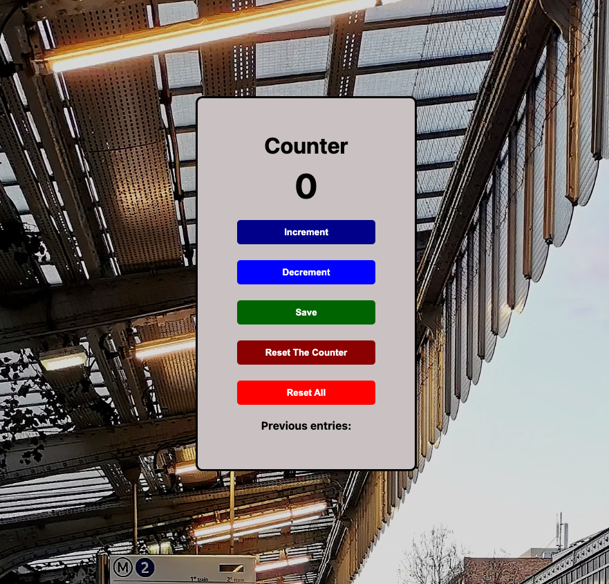

# Counter App

Welcome to the **Counter App**! This simple JavaScript application allows you to increment, decrement, save, reset the counter, and reset all counters. Keep track of your counts and review your previous entries in a neat and organized way.

## Table of Contents

-   [Features](#features)
-   [Usage](#usage)
-   [How It Works](#how-it-works)
-   [Contributing](#contributing)
-   [License](#license)

## Features

-   **Increment and Decrement Buttons:** Increase or decrease the counter with the click of a button.
-   **Save Button:** Store your current count and review your previous entries.
-   **Reset The Counter Button:** Reset the counter to zero.
-   **Reset All Button:** Reset both the counter and previous entries.

## Usage

1. Open the HTML file in your web browser.
2. Use the "Increment" and "Decrement" buttons to adjust the counter.
3. Click the "Save" button to store the current count in the previous entries.
4. Press the "Reset The Counter" button to reset the counter to zero.
5. Click the "Reset All" button to reset both the counter and previous entries.

## How It Works

The application uses simple HTML and JavaScript to manage the counter and track previous entries. Here's a brief overview:

-   The counter value is displayed using the `count-el` element.
-   Buttons with `increment-btn`, `decrement-btn`, `save-btn`, `reset-counter-btn`, and `reset-all-btn` IDs trigger corresponding functions in the JavaScript code.
-   The `increment()` and `decrement()` functions adjust the counter value.
-   The `save()` function concatenates the current count with a comma separator and displays it in the "Previous entries" paragraph.
-   The `reset()` function resets the counter to zero.
-   The `resetAll()` function resets both the counter and previous entries.

## Contributing

Feel free to contribute to the development of this Counter App. Whether you want to add new features, fix bugs, or enhance the user interface, your contributions are welcome.

## License

This Counter App is licensed under the [MIT License](LICENSE). Feel free to use, modify, and distribute the code for your own projects.

Happy counting! 🚀
